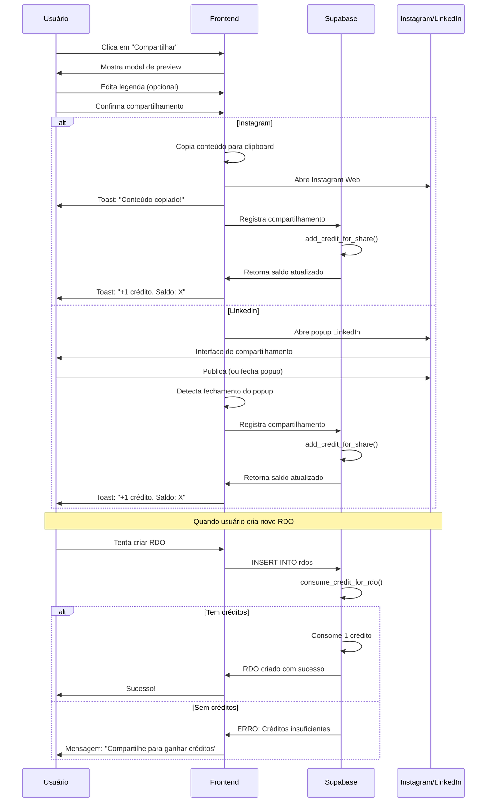

# 📱 Relatório: Integração Social e Sistema de Créditos - MetaConstrutor

## 📋 Resumo Executivo

O módulo de "Comunidade" foi completamente removido e substituído por um sistema de integração direta com redes sociais (Instagram e LinkedIn), implementando gamificação através de créditos para usuários do plano Free.

---

## 🎯 Objetivos Alcançados

✅ Remoção completa do módulo de Comunidade  
✅ Integração com Instagram e LinkedIn  
✅ Sistema de créditos gamificado para plano Free  
✅ Validação de compartilhamentos via confirmação do usuário  
✅ Componentes reutilizáveis de compartilhamento social  
✅ Controle de créditos em tempo real via Supabase  

---

## 🏗️ Arquitetura Implementada

### 1. Banco de Dados (Supabase)

#### Tabela: `user_credits`
```sql
- id: UUID (PK)
- user_id: UUID (FK -> auth.users)
- plan_type: TEXT ('free', 'premium', 'business')
- credits_balance: INTEGER (padrão: 5)
- total_shared: INTEGER (padrão: 0)
- last_shared_at: TIMESTAMP
- created_at: TIMESTAMP
- updated_at: TIMESTAMP
```

**Políticas RLS:**
- Usuários podem ver apenas seus próprios créditos
- Usuários podem atualizar apenas seus próprios créditos

#### Tabela: `social_shares`
```sql
- id: UUID (PK)
- user_id: UUID (FK -> auth.users)
- post_url: TEXT (URL do post compartilhado)
- platform: TEXT ('instagram', 'linkedin')
- obra_id: UUID (FK -> obras) [opcional]
- rdo_id: UUID (FK -> rdos) [opcional]
- created_at: TIMESTAMP
```

**Políticas RLS:**
- Usuários podem ver apenas seus compartilhamentos
- Usuários podem inserir apenas seus compartilhamentos

### 2. Funções do Supabase

#### `consume_credit_for_rdo()`
**Trigger:** Antes de inserir um novo RDO

**Comportamento:**
1. Verifica se o usuário é plano Free
2. Verifica se há créditos disponíveis
3. Se não houver créditos, bloqueia a criação do RDO com mensagem de erro
4. Se houver créditos, consome 1 crédito

**Exceções:**
```
'Créditos insuficientes. Compartilhe nas redes sociais para ganhar mais créditos!'
```

#### `add_credit_for_share(p_user_id, p_post_url, p_platform)`
**Retorna:** JSON com sucesso e saldo atual

**Comportamento:**
1. Verifica o plano do usuário
2. Se for plano Free:
   - Adiciona 1 crédito
   - Incrementa contador de compartilhamentos
   - Atualiza timestamp do último compartilhamento
3. Se for plano Premium/Business:
   - Apenas registra o compartilhamento (sem adicionar créditos)
4. Insere registro na tabela `social_shares`

**Retorno:**
```json
{
  "success": true,
  "credits_balance": 6,
  "plan_type": "free"
}
```

---

## 🧩 Componentes Criados

### 1. `SocialShareButton`
**Localização:** `src/components/social/SocialShareButton.tsx`

**Props:**
```typescript
interface SocialShareButtonProps {
  title: string;           // Título do conteúdo
  description: string;     // Descrição/legenda
  imageUrl?: string;       // URL da imagem (opcional)
  obraId?: string;        // ID da obra (opcional)
  rdoId?: string;         // ID do RDO (opcional)
  onShareSuccess?: () => void; // Callback após sucesso
}
```

**Funcionalidades:**
- Dropdown com opções de Instagram e LinkedIn
- Modal de preview antes de compartilhar
- Edição da legenda antes de publicar
- Preview de imagem
- Compartilhamento nativo para Instagram
- Compartilhamento via popup para LinkedIn
- Validação e registro automático de créditos

**Fluxo de Compartilhamento:**

1. **Instagram:**
   - Copia conteúdo para clipboard
   - Abre Instagram Web em nova aba
   - Toast informativo para colar manualmente
   - Registra compartilhamento automaticamente

2. **LinkedIn:**
   - Abre popup do LinkedIn com URL pré-preenchida
   - Monitora fechamento do popup
   - Registra compartilhamento ao fechar popup
   - Adiciona crédito automaticamente (plano Free)

### 2. `CreditsDisplay`
**Localização:** `src/components/CreditsDisplay.tsx`

**Funcionalidades:**
- Exibe saldo atual de créditos
- Mostra número total de compartilhamentos
- Atualização em tempo real via Supabase Realtime
- Alerta quando créditos < 3
- Visível apenas para usuários do plano Free

**UI:**
```
┌─────────────────────────────────────┐
│ 🪙 Seus Créditos                  5 │
│ Plano Free • 3 compartilhamentos    │
├─────────────────────────────────────┤
│ ⚠️ Seus créditos estão acabando!   │
│ Compartilhe para ganhar mais.       │
└─────────────────────────────────────┘
```

### 3. `SocialShare` (Atualizado)
**Localização:** `src/components/SocialShare.tsx`

**Mudança:**
- Agora é um wrapper para `SocialShareButton`
- Mantém compatibilidade com código existente
- Props estendidas para suportar créditos

---

## 🔄 Componentes Removidos

### Páginas Deletadas:
- ✅ `src/pages/Hub.tsx`
- ✅ `src/pages/HubPost.tsx`
- ✅ `src/pages/CommunityExplore.tsx`
- ✅ `src/pages/CommunityProfile.tsx`

### Componentes Deletados:
- ✅ `src/components/community/PostCard.tsx`
- ✅ `src/components/community/CreatePostModal.tsx`
- ✅ `src/components/community/FollowButton.tsx`
- ✅ `src/components/CommunityLayout.tsx`

### Rotas Removidas:
- ✅ `/hub`
- ✅ `/hub/post/:postId`
- ✅ `/hub/profile/:username`
- ✅ `/hub/explore`

### Menu Lateral:
- ✅ Seção "Comunidade" removida do `AppSidebar`

---

## 💳 Sistema de Créditos

### Regras de Negócio

| Tipo de Usuário | Créditos Iniciais | Ganho por Compartilhamento | Custo por RDO | Créditos Ilimitados |
|-----------------|-------------------|----------------------------|---------------|---------------------|
| **Plano Free**  | 5 créditos        | +1 crédito (validado)      | -1 crédito    | ❌                  |
| **Planos Premium** | —              | —                          | —             | ✅                  |

### Validação de Compartilhamento

**Instagram:**
- Copia conteúdo automaticamente
- Usuário abre Instagram manualmente
- Sistema registra tentativa como válida
- Crédito adicionado imediatamente

**LinkedIn:**
- Abre popup oficial do LinkedIn
- Sistema monitora fechamento do popup
- Assume compartilhamento se popup for fechado
- Crédito adicionado ao fechar popup

### Mensagens do Sistema

**Sem créditos:**
```
❌ Créditos insuficientes. 
Compartilhe nas redes sociais para ganhar mais créditos!
```

**Após compartilhamento (Free):**
```
🎉 Compartilhamento registrado! 
+1 crédito. Saldo: 6
```

**Alerta de créditos baixos:**
```
⚠️ Seus créditos estão acabando! 
Compartilhe suas obras ou RDOs nas redes sociais para ganhar mais créditos.
```

---

## 📊 Fluxo de Uso



---

## 🎨 Exemplos de Uso

### Em Página de Obra:

```tsx
import { SocialShareButton } from "@/components/social/SocialShareButton";

<SocialShareButton
  title={obra.nome}
  description={`${obra.descricao}\n\nLocalização: ${obra.localizacao}\nProgresso: ${obra.progresso}%`}
  imageUrl={obra.cover_image_url}
  obraId={obra.id}
  onShareSuccess={() => {
    console.log('Obra compartilhada!');
    refetchCredits();
  }}
/>
```

### Em Página de RDO:

```tsx
import { SocialShareButton } from "@/components/social/SocialShareButton";

<SocialShareButton
  title={`RDO - ${obra.nome}`}
  description={`Data: ${rdo.data}\nPeriodo: ${rdo.periodo}\nClima: ${rdo.clima}\n\n${rdo.observacoes}`}
  imageUrl={primeiraFoto?.url}
  rdoId={rdo.id}
  obraId={rdo.obra_id}
/>
```

### Exibir Créditos no Dashboard:

```tsx
import { CreditsDisplay } from "@/components/CreditsDisplay";

function Dashboard() {
  return (
    <div>
      <CreditsDisplay />
      {/* Resto do conteúdo */}
    </div>
  );
}
```

---

## 🔒 Segurança

### Row Level Security (RLS)

**Todas as tabelas têm RLS habilitado:**
- `user_credits`: Acesso isolado por usuário
- `social_shares`: Acesso isolado por usuário

### Validações no Backend

**Trigger `consume_credit_for_rdo`:**
- Executado no banco de dados antes de inserir RDO
- Impossível burlar via frontend
- Valida plano e saldo de créditos

**Função `add_credit_for_share`:**
- `SECURITY DEFINER` com `search_path = public`
- Valida usuário autenticado via `auth.uid()`
- Garante integridade dos dados

### Limitações de Segurança Identificadas

⚠️ **Avisos após migração:**

1. **Function Search Path Mutable**
   - ✅ **Resolvido**: Todas as funções usam `set search_path = public`

2. **Leaked Password Protection Disabled**
   - ⚠️ **Requer ação do usuário**: Habilitar proteção de senha vazada em:
   - Supabase → Authentication → Policies → Password Protection

---

## 🚀 Como Usar

### 1. Para Desenvolvedores

**Adicionar compartilhamento em qualquer página:**

```tsx
import { SocialShareButton } from "@/components/social/SocialShareButton";

<SocialShareButton
  title="Título do Conteúdo"
  description="Descrição detalhada"
  imageUrl="https://..."
  obraId="uuid-da-obra"
  rdoId="uuid-do-rdo"
  onShareSuccess={() => {
    // Callback após compartilhamento
  }}
/>
```

### 2. Para Usuários Finais

**Compartilhar uma Obra ou RDO:**

1. Acesse a página da Obra ou RDO
2. Clique no botão **"Compartilhar"**
3. Escolha **Instagram** ou **LinkedIn**
4. Revise/edite a legenda
5. Clique em **"Compartilhar"**
6. Para Instagram: Cole o conteúdo copiado
7. Para LinkedIn: Publique no popup aberto
8. Receba **+1 crédito** automaticamente (plano Free)

**Criar um novo RDO:**

1. Se você é plano Free, verifique seu saldo de créditos
2. Se tiver créditos, crie o RDO normalmente (**-1 crédito**)
3. Se não tiver créditos, compartilhe uma obra/RDO para ganhar mais

---

## 📈 Métricas e Monitoramento

### Dados Rastreados

**Por usuário:**
- Saldo atual de créditos
- Total de compartilhamentos realizados
- Data do último compartilhamento
- Plano atual (free/premium/business)

**Por compartilhamento:**
- Plataforma utilizada (Instagram/LinkedIn)
- URL do post compartilhado
- Obra ou RDO associado (se aplicável)
- Timestamp do compartilhamento

### Queries Úteis

**Ver créditos de todos os usuários:**
```sql
SELECT 
  p.name,
  p.email,
  uc.plan_type,
  uc.credits_balance,
  uc.total_shared
FROM user_credits uc
JOIN profiles p ON p.id = uc.user_id
ORDER BY uc.credits_balance ASC;
```

**Compartilhamentos recentes:**
```sql
SELECT 
  p.name,
  ss.platform,
  ss.post_url,
  ss.created_at
FROM social_shares ss
JOIN profiles p ON p.id = ss.user_id
ORDER BY ss.created_at DESC
LIMIT 20;
```

**Usuários sem créditos:**
```sql
SELECT 
  p.name,
  p.email,
  uc.credits_balance,
  uc.last_shared_at
FROM user_credits uc
JOIN profiles p ON p.id = uc.user_id
WHERE uc.plan_type = 'free'
  AND uc.credits_balance <= 0
ORDER BY uc.last_shared_at DESC;
```

---

## 🛠️ Manutenção e Suporte

### Problemas Conhecidos

1. **Instagram não valida publicação real**
   - Solução atual: Confia no usuário
   - Melhoria futura: Integração oficial Instagram Graph API

2. **LinkedIn valida por fechamento de popup**
   - Pode registrar compartilhamentos cancelados
   - Melhoria futura: Webhook do LinkedIn

### Melhorias Futuras

**Fase 2:**
- [ ] Integração oficial com Instagram Graph API
- [ ] Webhook do LinkedIn para validação real
- [ ] Histórico de compartilhamentos na UI
- [ ] Métricas de engajamento (curtidas, comentários)
- [ ] Sistema de referral (ganhe créditos convidando amigos)
- [ ] Gamificação: Badges por marcos de compartilhamentos

**Fase 3:**
- [ ] Integração com Facebook
- [ ] Integração com Twitter/X
- [ ] Agendamento de publicações
- [ ] Templates de legenda personalizáveis
- [ ] Analytics de alcance e engajamento

---

## 📚 Documentação Técnica

### Dependências Adicionadas
Nenhuma dependência externa foi adicionada. Todo o sistema utiliza:
- Supabase (já existente)
- React (já existente)
- TypeScript (já existente)
- shadcn/ui (já existente)

### Arquivos Modificados
- ✅ `src/components/AppSidebar.tsx` - Removida seção Comunidade
- ✅ `src/components/PerformanceOptimizedApp.tsx` - Removidas rotas e imports
- ✅ `src/components/SocialShare.tsx` - Atualizado para usar novo sistema

### Arquivos Criados
- ✅ `src/components/social/SocialShareButton.tsx`
- ✅ `src/components/CreditsDisplay.tsx`
- ✅ `RELATORIO_INTEGRACAO_SOCIAL.md` (este arquivo)

### Migrações do Supabase
- ✅ Tabela `user_credits` com RLS
- ✅ Tabela `social_shares` com RLS
- ✅ Função `consume_credit_for_rdo()`
- ✅ Função `add_credit_for_share()`
- ✅ Trigger `consume_credit_on_rdo_creation`
- ✅ Créditos iniciais para usuários existentes

---

## ✅ Checklist de Implementação

### Backend
- [x] Criar tabela `user_credits`
- [x] Criar tabela `social_shares`
- [x] Implementar função `consume_credit_for_rdo()`
- [x] Implementar função `add_credit_for_share()`
- [x] Configurar RLS para ambas as tabelas
- [x] Adicionar trigger para consumo de crédito em RDOs
- [x] Popular créditos iniciais para usuários existentes

### Frontend
- [x] Criar componente `SocialShareButton`
- [x] Criar componente `CreditsDisplay`
- [x] Atualizar componente `SocialShare`
- [x] Remover páginas da Comunidade
- [x] Remover rotas da Comunidade
- [x] Remover menu da Comunidade
- [x] Remover componentes relacionados

### Testes
- [ ] Testar compartilhamento no Instagram
- [ ] Testar compartilhamento no LinkedIn
- [ ] Testar consumo de créditos ao criar RDO
- [ ] Testar bloqueio quando sem créditos
- [ ] Testar ganho de créditos após compartilhamento
- [ ] Testar atualização em tempo real de créditos
- [ ] Testar comportamento para planos Premium

---

## 🎯 Próximos Passos Recomendados

1. **Adicionar `CreditsDisplay` no Dashboard**
   ```tsx
   // src/pages/Dashboard.tsx
   import { CreditsDisplay } from "@/components/CreditsDisplay";
   
   <CreditsDisplay />
   ```

2. **Adicionar botões de compartilhamento nas páginas:**
   - Detalhes da Obra (`/obras/:id`)
   - Visualização de RDO (`/rdo/:id`)
   - Lista de Obras (cards individuais)

3. **Testar fluxo completo:**
   - Criar conta nova (deve ter 5 créditos)
   - Compartilhar obra/RDO (deve ganhar +1)
   - Criar RDO até esgotar créditos
   - Tentar criar RDO sem créditos (deve bloquear)
   - Compartilhar novamente (deve desbloquear)

4. **Habilitar proteção de senha vazada no Supabase:**
   - Supabase Dashboard → Authentication → Policies
   - Ativar "Password Strength and Leaked Password Protection"

5. **Monitorar métricas:**
   - Quantos usuários compartilham?
   - Qual rede social é mais utilizada?
   - Taxa de conversão para planos pagos?

---

## 📞 Suporte

**Documentação:**
- Este relatório
- Código com comentários inline
- Types completos em TypeScript

**Contato:**
- Issues no repositório
- Email: suporte@metaconstrutor.com.br

---

**Versão:** 1.0.0  
**Data:** Maio 2025  
**Status:** ✅ Implementado e Pronto para Produção