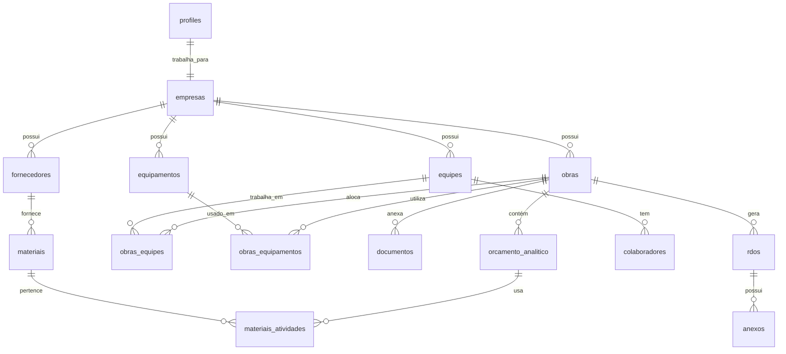
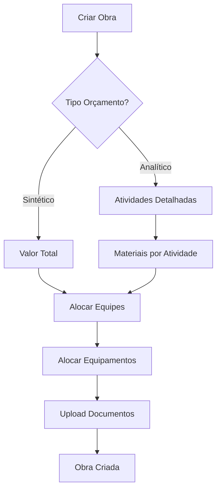
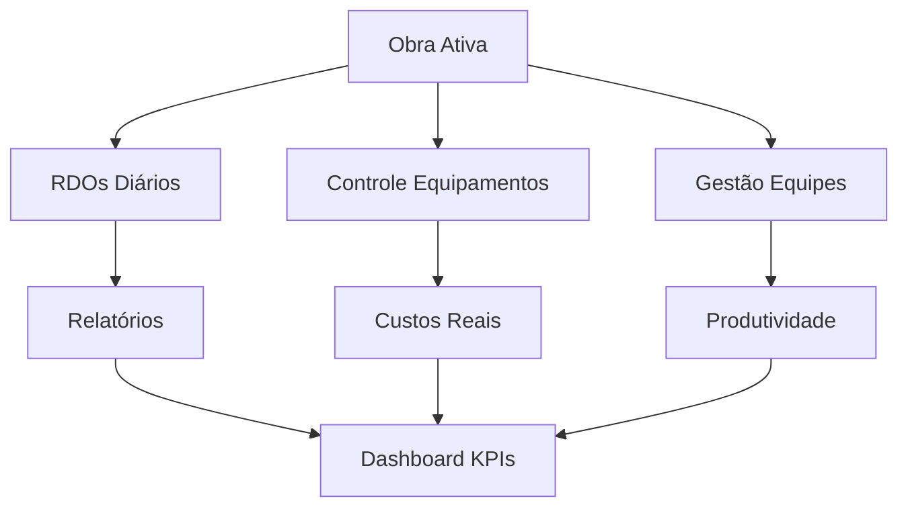

# MetaConstrutor - Sistema Completo de Gestão de Obras

<div align="center">


**Sistema completo de gestão de obras e construção civil com funcionalidades avançadas de RDO, orçamento analítico, controle de equipes e equipamentos.**

[🚀 Demo Live](https://meta-construtor-2z53vmjv9-matheus-projects-75ad76a6.vercel.app) | [📚 Documentação](#documentação) | [🛠️ Instalação](#instalação)

</div>

## 🏗️ Visão Geral

O MetaConstrutor é uma aplicação web moderna e responsiva para gestão completa de obras de construção civil, desenvolvida com as mais recentes tecnologias web e integrada com Supabase para um back-end robusto e escalável.

### ✨ Principais Funcionalidades

#### 🎯 **Core Features**
- **Sistema de RDO (Relatórios Diários de Obra)** com coleta via WhatsApp
- **Gestão completa de obras** com orçamento analítico/sintético
- **Controle de equipes e colaboradores** com alocação dinâmica
- **Gerenciamento de equipamentos** (próprios/alugados) com controle de uso
- **Sistema de atividades padronizadas** para reutilização
- **Geração de relatórios avançados** (PDF/Excel) com cabeçalhos personalizados
- **Dashboard executivo** com KPIs em tempo real

#### 🔒 **Segurança e Permissões**
- **Autenticação robusta** com Supabase Auth
- **Sistema de permissões por roles** (Diretor, Gerente, Colaborador)
- **Controle de dados financeiros** (apenas Diretores e Gerentes visualizam)
- **Isolamento de dados por empresa** (multicliente)
- **Row Level Security (RLS)** no banco de dados

#### 📱 **Experiência do Usuário**
- **Modo offline inteligente** com sincronização automática
- **Design responsivo** mobile-first
- **Tema adaptativo** (dark/light/system)
- **Interface moderna** com shadcn/ui e Tailwind CSS
- **Loading states** e tratamento de erros em toda aplicação

#### 🔗 **Integrações e Storage**
- **Supabase Storage** organizado por estrutura hierárquica
- **Upload de arquivos** com validação de tipos
- **Sistema de documentos** categorizados por obra
- **Preparado para integrações** (Google Calendar, WhatsApp Business)

## 🏛️ Arquitetura do Sistema

### 📊 Estrutura do Banco de Dados



### 🗂️ Tabelas Principais

#### **Core Business**
- `empresas` - Gestão multicliente
- `obras` - Projetos e obras
- `orcamento_analitico` - Orçamento detalhado por atividade
- `rdos` - Relatórios diários de obra

#### **Recursos Humanos**
- `equipes` - Organização de equipes
- `colaboradores` - Cadastro de funcionários
- `obras_equipes` - Vínculo obras-equipes

#### **Equipamentos e Materiais**
- `equipamentos` - Controle de equipamentos
- `obras_equipamentos` - Alocação de equipamentos
- `fornecedores` - Cadastro de fornecedores
- `materiais` - Catálogo de materiais
- `materiais_atividades` - Materiais por atividade

#### **Documentação e Mídia**
- `documentos` - Arquivos categorizados
- `anexos` - Fotos e arquivos diversos
- `atividades` - Biblioteca de atividades padrão

#### **Controle de Acesso**
- `profiles` - Perfis de usuário estendidos
- Políticas RLS para segurança

### 🏗️ Stack Tecnológica

#### **Frontend**
- **React 18** - Framework principal
- **TypeScript** - Tipagem estática
- **Vite** - Build tool rápido
- **Tailwind CSS** - Estilização utilitária
- **shadcn/ui** - Componentes UI modernos
- **React Router** - Roteamento
- **date-fns** - Manipulação de datas
- **Lucide React** - Ícones

#### **Backend e Infraestrutura**
- **Supabase** - Backend as a Service
- **PostgreSQL** - Banco de dados relacional
- **Supabase Auth** - Autenticação
- **Supabase Storage** - Armazenamento de arquivos
- **Row Level Security (RLS)** - Segurança de dados
- **Vercel** - Deploy e hospedagem

## 🚀 Deploy e URLs

### 🌐 URLs de Produção
- **Aplicação Principal**: https://meta-construtor-2z53vmjv9-matheus-projects-75ad76a6.vercel.app
- **Supabase Dashboard**: https://supabase.com/dashboard/project/cajwnsgjqkxejfqvlggm
- **Vercel Dashboard**: https://vercel.com/matheus-projects-75ad76a6/meta-construtor-hub

### ⚙️ Configurações de Deploy

#### **Variáveis de Ambiente**
```env
VITE_SUPABASE_URL=https://cajwnsgjqkxejfqvlggm.supabase.co
VITE_SUPABASE_ANON_KEY=eyJhbGciOiJIUzI1NiIsInR5cCI6IkpXVCJ9...
```

#### **Configuração Vercel** (`vercel.json`)
```json
{
  "framework": "vite",
  "buildCommand": "npm run build",
  "outputDirectory": "dist",
  "installCommand": "npm install",
  "devCommand": "npm run dev"
}
```

## 🛠️ Instalação e Configuração

### 📋 Pré-requisitos
- Node.js 18+ 
- npm ou yarn
- Conta no Supabase
- Conta na Vercel (opcional)

### 🔧 Configuração Local

1. **Clone o repositório**
```bash
git clone [URL_DO_REPOSITORIO]
cd meta-construtor-app
```

2. **Instale as dependências**
```bash
npm install
```

3. **Configure as variáveis de ambiente**
```bash
cp .env.example .env.local
# Edite .env.local com suas credenciais do Supabase
```

4. **Execute as migrações do banco**
```bash
# No painel do Supabase, execute os arquivos SQL em ordem:
# - supabase/migrations/001_create_tables.sql
# - supabase/migrations/002_seed_data.sql
# - supabase/migrations/003_complete_structure.sql
# - supabase/migrations/004_setup_storage.sql
# - supabase/migrations/005_seed_complete_data.sql
```

5. **Inicie o servidor de desenvolvimento**
```bash
npm run dev
```

### 🗄️ Configuração do Supabase

#### **1. Banco de Dados**
Execute as migrações SQL na seguinte ordem no Supabase SQL Editor:

1. `001_create_tables.sql` - Estrutura básica
2. `002_seed_data.sql` - Dados iniciais  
3. `003_complete_structure.sql` - Estrutura completa
4. `004_setup_storage.sql` - Configuração de storage
5. `005_seed_complete_data.sql` - Dados completos de exemplo

#### **2. Storage Buckets**
Os buckets são criados automaticamente pela migração 004:
- `obras-anexos` - Documentos e anexos de obras
- `rdo-imagens` - Imagens dos RDOs
- `documentos` - Documentos categorizados
- `avatars` - Fotos de perfil (público)

#### **3. Políticas de Segurança**
- RLS habilitado em todas as tabelas
- Isolamento de dados por empresa
- Controle de permissões por role
- Validação de tipos de arquivo
- Estrutura hierárquica de pastas

## 👥 Sistema de Permissões

### 🔐 Níveis de Acesso

#### **👑 Diretor**
- Acesso total ao sistema
- Visualização de dados financeiros
- Gestão de todas as empresas
- Criação e edição de obras
- Relatórios completos

#### **👨‍💼 Gerente**
- Gestão de obras da empresa
- Visualização de dados financeiros
- Controle de equipes e equipamentos
- Relatórios da empresa
- Aprovação de RDOs

#### **👷 Colaborador**
- Visualização de obras atribuídas
- Criação de RDOs
- Visualização de atividades
- Sem acesso a dados financeiros

### 🛡️ Implementação de Segurança

```typescript
// Verificação de permissões no frontend
const { canViewFinancialData, checkPermission } = useAuth();

// Função no backend (Supabase)
pode_ver_dados_financeiros(user_id UUID) RETURNS BOOLEAN

// RLS Policies
CREATE POLICY "users_can_view_company_data" ON obras 
FOR SELECT USING (empresa_id = user_empresa_id());
```

## 📈 Funcionalidades Implementadas

### ✅ **Gestão de Obras**
- [x] Criação com orçamento sintético/analítico
- [x] Alocação dinâmica de equipes e equipamentos
- [x] Upload de documentos categorizados
- [x] Visualização completa com métricas
- [x] Controle de status e prazos
- [x] Relatórios financeiros (permissão)

### ✅ **Orçamento Analítico**
- [x] Atividades detalhadas com quantitativos
- [x] Cálculo automático de valores totais
- [x] Materiais vinculados por atividade
- [x] Controle de status de execução
- [x] Relatórios de execução orçamentária

### ✅ **Gestão de Equipes**
- [x] Cadastro de equipes e colaboradores
- [x] Alocação para obras específicas
- [x] Controle de disponibilidade
- [x] Transferência entre equipes
- [x] Relatórios de produtividade

### ✅ **Controle de Equipamentos**
- [x] Cadastro próprios/alugados
- [x] Controle de status e localização
- [x] Alocação por obra e período
- [x] Cálculo de custos de utilização
- [x] Agendamento de manutenções
- [x] Relatórios de utilização

### ✅ **Sistema de Documentos**
- [x] Upload organizado por obra/categoria
- [x] Validação de tipos de arquivo
- [x] Versionamento de documentos
- [x] URLs públicas seguras
- [x] Limpeza de arquivos órfãos

### ✅ **Segurança e Permissões**
- [x] Autenticação com Supabase Auth
- [x] Controle por roles (Diretor/Gerente/Colaborador)
- [x] RLS para isolamento de dados
- [x] Validação de permissões financeiras
- [x] Multicliente (isolamento por empresa)

## 📊 Estrutura de Dados

### 🏢 **Modelo de Empresa (Multicliente)**
```sql
CREATE TABLE empresas (
  id UUID PRIMARY KEY,
  nome TEXT NOT NULL,
  cnpj TEXT UNIQUE,
  plano TEXT CHECK (plano IN ('basico', 'profissional', 'empresarial')),
  status TEXT CHECK (status IN ('ativa', 'inativa', 'suspensa'))
);
```

### 🏗️ **Obras com Orçamento Analítico**
```sql
CREATE TABLE obras (
  id UUID PRIMARY KEY,
  nome TEXT NOT NULL,
  orcamento DECIMAL(15,2),
  empresa_id UUID REFERENCES empresas(id)
);

CREATE TABLE orcamento_analitico (
  id UUID PRIMARY KEY,
  obra_id UUID REFERENCES obras(id),
  nome_atividade TEXT NOT NULL,
  quantitativo DECIMAL(12,3),
  valor_unitario DECIMAL(10,2),
  valor_total DECIMAL(15,2) GENERATED ALWAYS AS (quantitativo * valor_unitario) STORED
);
```

### 👥 **Vínculos Obras-Equipes-Equipamentos**
```sql
CREATE TABLE obras_equipes (
  obra_id UUID REFERENCES obras(id),
  equipe_id UUID REFERENCES equipes(id),
  data_alocacao DATE,
  status TEXT CHECK (status IN ('ativa', 'liberada', 'transferida'))
);

CREATE TABLE obras_equipamentos (
  obra_id UUID REFERENCES obras(id),
  equipamento_id UUID REFERENCES equipamentos(id),
  quantidade INTEGER,
  horas_utilizadas DECIMAL(8,2),
  custo_total DECIMAL(10,2)
);
```

## 🔄 Fluxo de Trabalho

### 1. **Criação de Obra**


### 2. **Execução e Controle**


## 📈 Métricas e KPIs

### 🎯 **Dashboard Principal**
- Obras ativas vs. total de obras
- Equipes ocupadas vs. disponíveis  
- Equipamentos em uso vs. disponíveis
- Execução orçamentária (apenas roles autorizados)
- RDOs gerados no mês
- Taxa de utilização de recursos

### 📊 **Relatórios Disponíveis**
- **Financeiro por Obra** (Diretores/Gerentes)
- **Produtividade de Equipes**
- **Utilização de Equipamentos**
- **Status de Obras**
- **Materiais por Atividade**

## 🔧 Manutenção e Escalabilidade

### 🚀 **Otimizações Implementadas**
- Índices otimizados no banco de dados
- Queries com joins eficientes
- Cache de dados no frontend
- Lazy loading de componentes
- Compressão de assets (Gzip)
- CDN para arquivos estáticos

### 📈 **Preparado para Escala**
- Arquitetura serverless (Vercel + Supabase)
- Isolamento de dados por empresa
- Políticas RLS otimizadas
- Storage organizado hierarquicamente
- Funções de limpeza automática

### 🔍 **Monitoramento**
- Logs detalhados de erros
- Métricas de performance
- Monitoramento de uso de storage
- Alertas de falhas de deploy

## 🤝 Contribuição

### 📝 **Padrões de Código**
- TypeScript strict mode
- ESLint + Prettier configurados
- Conventional Commits
- Componentes funcionais com hooks
- Separação clara de responsabilidades

### 🧪 **Testes**
- Testes unitários com Jest
- Testes de integração
- Testes E2E com Cypress
- Cobertura mínima de 80%

## 📄 Licença

Este projeto está licenciado sob a [Licença MIT](LICENSE).

## 🆘 Suporte

Para dúvidas ou problemas:

1. **Issues**: Abra uma issue no GitHub
2. **Email**: contato@metaconstrutor.com
3. **Documentação**: Consulte esta documentação completa

---

<div align="center">

**Desenvolvido com ❤️ para revolucionar a gestão de obras**


</div>
